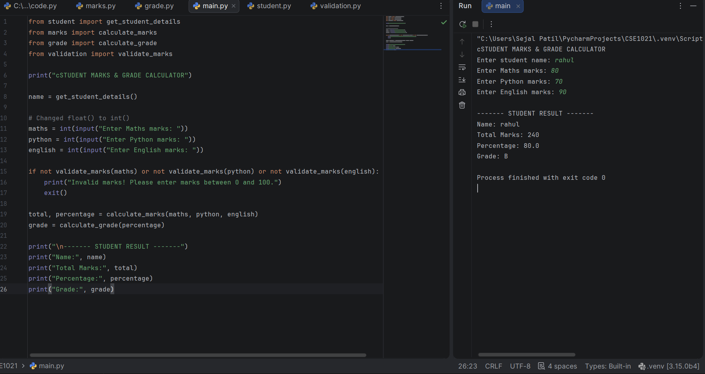
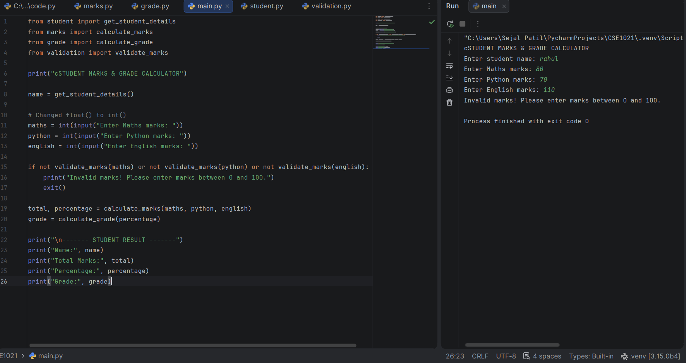
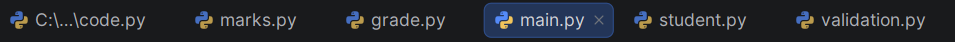

# Student Marks & Grade Calculator

## Project Overview

Student Marks & Grade Calculator is a simple Python-based project that calculates a student's total marks, percentage, and grade.

The project also validates the marks entered by the user to ensure that they are between 0 and 100.

## Features

- Enter student name
- Enter marks for Maths, Python, and English
- Validate marks
- Calculate total marks
- Calculate percentage
- Generate grade
- Display the final student result

## Technologies Used

- Python
- PyCharm
- GitHub

## Project Structure

- `main.py` - Main program that connects all modules
- `student.py` - Collects student information
- `marks.py` - Calculates total marks and percentage
- `grade.py` - Calculates the grade
- `validation.py` - Validates marks between 0 and 100
- `statement.md` - Contains the project statement

## How to Run

1. Download or clone this repository.
2. Open the project in PyCharm or another Python IDE.
3. Run `main.py`.
4. Enter the student name.
5. Enter marks for Maths, Python, and English.
6. The program displays the total marks, percentage, and grade.

## Testing

The project was tested with valid marks such as 80, 90, and 70.

The validation feature was also tested with an invalid mark such as 110. The program correctly displayed an invalid marks message.

## Target Users

- Students
- Teachers
- Academic users

## Screenshots

### Successful Output

### Validation Test

### Project Structure

## Future Enhancements

- Add more subjects
- Store student results
- Generate a result report
- Add a graphical user interface
